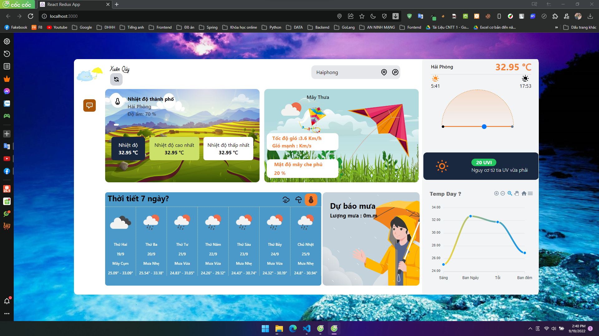

  

 Live Demo: http://weathertonydev.cf/ hoặc ip : 138.2.34.135

 Tìm thời tiết hiện tại và dự báo trong 7 ngày của bất kỳ thành phố nào trên trái đất với ứng dụng web nhỏ đơn giản này.

Ứng dụng web React đơn giản được viết bằng jsx trả về thời tiết hiện tại. Ứng dụng sử dụng:

    <ul>
        <li>API của OpenWeatherMap : https://openweathermap.org/api</li>
        <li>Các biểu tượng của OpenWeatherMap cho các biểu tượng thời tiết</li>
        <li>create-react-app my-app --template redux</li>
        <li>API của OpenWeatherMap</li>
        <li>Axios for easy http requests</li>
        <li>Tailwind CSS for styling and design</li>
    </ul>

